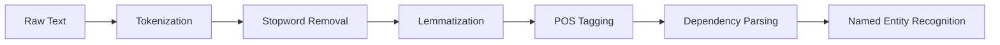

# Natural Language Processing (NLP) with SpaCy

## 📌 Introduction

### Types of Data:
- **Structured Data**
- **Semi-structured Data**
- **Unstructured Data** (More than 80% of today's data)
  - Examples: Text, Videos, Images

### Why NLP?
NLP helps process and interpret unstructured data for various applications, including:
- **Sentiment Analysis**
- **Speech Recognition**
- **Text Classification**
- **Machine Translation**
- **Semantic Search**
- **News/Article Summarization**
- **Question Answering**

### Key NLP Applications
| Category          | Examples                          | Real-World Use Cases             |
|-------------------|-----------------------------------|-----------------------------------|
| **Analysis**      | Sentiment, Intent                 | Customer feedback analysis       |
| **Generation**    | Translation, Summarization        | Google Translate                 |
| **Recognition**   | Speech, Named Entities            | Alexa voice commands             |
| **Classification**| Spam detection, Topic labeling    | Email filtering systems          |

---

## 🛠 Install & Load Python Libraries for NLP

### Popular NLP Libraries:
- **NLTK**
- **SpaCy**
- **Gensim**
- **Transformers**

### Installation:
```bash
pip install nltk spacy gensim transformers
```

### Downloading SpaCy Model:
```bash
python -m spacy download en_core_web_sm
```

---

## 📝 Text Preprocessing

### Text Processing Pipeline

---

### Why Preprocessing?
Raw text (corpus) contains **noise** like punctuation, special symbols, and stop words. Preprocessing helps clean the text for better analysis.

### Example:
```python
import spacy

nlp = spacy.load('en_core_web_sm')
raw_text = 'NLP is a very powerful tool'
text_doc = nlp(raw_text)

print(text_doc)
print(type(text_doc))
```

---

## 🔹 Tokenization

### What is a Token?
A **token** is a word or symbol extracted from text, separated by spaces and punctuation.

### Tokenization Example:
```python
import spacy

nlp = spacy.load('en_core_web_sm')
raw_text = 'NLP is a very powerful tool'
text_doc = nlp(raw_text)

for token in text_doc:
    print(token.text)
```

### Checking Token Properties:
```python
import spacy

nlp = spacy.load('en_core_web_sm')
mixed_text = 'My salary is $1000 dollars'
mixed_text_doc = nlp(mixed_text)

for token in mixed_text_doc:
    print(token.text.ljust(10), token.is_alpha)
```

### Advanced Tokenization
```python
import spacy
nlp = spacy.load("en_core_web_sm")

text = "Apple's $2 billion AI investment in 2023 surprised analysts!"
doc = nlp(text)

# Enhanced token analysis
print(f"{'Token':<15} | {'Lemma':<10} | {'POS':<8} | {'Entity'}")
print("-"*50)
for token in doc:
    print(f"{token.text:<15} | {token.lemma_:<10} | {token.pos_:<8} | {token.ent_type_}")
```
**Output:**
```
Token           | Lemma      | POS      | Entity
--------------------------------------------------
Apple           | Apple      | PROPN    | ORG
's              | 's         | PART     | 
$               | $          | SYM      | MONEY
2               | 2          | NUM      | MONEY
billion         | billion    | NUM      | MONEY
AI              | AI         | PROPN    | 
investment      | investment | NOUN     | 
in              | in         | ADP      | 
2023            | 2023       | NUM      | DATE
surprised       | surprise   | VERB     | 
analysts        | analyst    | NOUN     | 
!               | !          | PUNCT    | 
```

---

## 🛑 Stop Words Removal

### Why Remove Stop Words?
Stop words (e.g., 'it', 'was', 'that') don’t provide significant information and can mislead models.

### Checking Stop Words in SpaCy:
```python
import spacy
from spacy.lang.en.stop_words import STOP_WORDS

nlp = spacy.load('en_core_web_sm')
list_stopwords = list(STOP_WORDS)
```

### Removing Stop Words:
```python
import spacy

nlp = spacy.load('en_core_web_sm')
raw_text = 'Hello good!!! morning how are you, today climate is very cool'
text_doc = nlp(raw_text)
filtered_text = [token for token in text_doc if not token.is_stop]

for token in filtered_text:
    print(token)
```

---

## 🔹 Stemming vs Lemmatization

### What is Stemming?
**Stemming** reduces words to their root form, but the results may not always be meaningful.

```python
from nltk.stem import PorterStemmer

ps = PorterStemmer()
words = ['dance', 'dances', 'dancing', 'danced']

for word in words:
    print(word, '------->', ps.stem(word))
```

**Issue:** Stemming may result in incorrect roots (e.g., 'danc' instead of 'dance').

### What is Lemmatization?
**Lemmatization** gives the correct base form of a word.

#### Using NLTK:
```python
from nltk.stem import WordNetLemmatizer

lemmatizer = WordNetLemmatizer()
words = ['dance', 'dances', 'dancing', 'danced']

for word in words:
    print(word, '------->', lemmatizer.lemmatize(word))
```

#### Using SpaCy:
```python
import spacy

nlp = spacy.load('en_core_web_sm')
text = 'dance dances dancing danced'
text_doc = nlp(text)

for token in text_doc:
    print(token.text, '-------', token.lemma_)
```

**Preferred Approach:** Lemmatization ensures meaningful words, making it better than stemming.

---

## 📊 Word Frequency Analysis

### Why Analyze Word Frequency?
- Frequent words indicate key themes in text.
- Helps focus on important concepts.

### Using Counter:
```python
from collections import Counter
import spacy

nlp = spacy.load('en_core_web_sm')
data = 'It is my birthday today. I could not have a birthday party. I felt sad'
data_doc = nlp(data)

list_of_tokens = [token.text for token in data_doc if not token.is_stop and not token.is_punct]
token_frequency = Counter(list_of_tokens)
print(token_frequency)
```

### Applying to Large Text Data:
```python
import spacy
from collections import Counter

nlp = spacy.load('en_core_web_sm')
longtext = '''Gangtok is a city, the capital of Sikkim...'''  # Large text here
long_text = nlp(longtext)

list_of_tokens = [token.text for token in long_text if not token.is_stop and not token.is_punct]
token_frequency = Counter(list_of_tokens)
print(token_frequency.most_common(6))  # Top 6 most frequent words
```

### Insights:
- Helps determine key topics in large datasets.
- Identifies the most frequent words for better understanding.

---

## 2. Part-of-Speech (POS) Tagging
### What is POS Tagging?
Each word in a sentence has a role (e.g., noun, verb). POS tagging is the process of assigning these roles to words.

### Example:
- **Sentence**: *Daniel is dancing.*
  - "Daniel" is a **noun** (person)
  - "dancing" is a **verb** (action)

### Common POS Tags:
- **Noun (NOUN)**
- **Verb (VERB)**
- **Adjective (ADJ)**
- **Pronoun (PRON)**
- **Adverb (ADV)**
- **Preposition (ADP)**
- **Conjunction (CONJ)**
- **Interjection (INTJ)**

### POS Tagging with SpaCy
```python
import spacy
nlp = spacy.load('en_core_web_sm')

text = "Daniel is singing loudly and his roommates are enjoying too"
doc = nlp(text)

for token in doc:
    print(token.text.ljust(10), '-----', token.pos_)
```

---
## 3. Text Preprocessing with SpaCy
### Removing Stopwords and Punctuation
```python
import spacy
nlp = spacy.load('en_core_web_sm')

with open('covid.txt') as file:
    text = file.read()

doc = nlp(text)
filtered_tokens = [token for token in doc if not token.is_stop and not token.is_punct]

print(filtered_tokens)
```

### Extracting Nouns and Verbs
```python
nouns = [token.text for token in doc if token.pos_ == 'NOUN']
verbs = [token.text for token in doc if token.pos_ == 'VERB']
```

---
## 4. Dependency Parsing
### What is Dependency Parsing?
Dependency parsing analyzes relationships between words in a sentence.
- **Head/Root Word**: The independent word (usually a verb)
- **Dependents**: Words that rely on the root

### Dependency Tags:
| Tag | Description |
|------|------------|
| **ROOT** | Main verb (headword) |
| **prep** | Prepositional modifier |
| **cc/conj** | Coordinating conjunctions (e.g., *and, or*) |
| **pobj** | Object of a preposition |
| **aux** | Auxiliary verb |
| **dobj** | Direct object |
| **det** | Determiner |

### Dependency Parsing Example
```python
import spacy
nlp = spacy.load('en_core_web_sm')

text = "Ardra fell into a well and fractured her leg"
doc = nlp(text)

for token in doc:
    print(token.text.ljust(10), '---', token.dep_)
```

### Visualizing Dependencies
```python
from spacy import displacy

displacy.render(doc, style='dep', jupyter=True)
```

### Finding Head/Root Words
```python
for token in doc:
    print(token.text.ljust(10), '---', token.head.text)
```

---
## 5. Named Entity Recognition (NER)
### What is NER?
NER identifies and categorizes named entities (e.g., people, organizations, locations) in a text.

### Common Entity Labels:
| Label | Description |
|-------|-------------|
| **ORG** | Companies, organizations |
| **PERSON** | Names of people |
| **GPE** | Countries, states, cities |
| **PRODUCT** | Products, brands |
| **LANGUAGE** | Languages |

### NER with SpaCy
```python
import spacy
nlp = spacy.load('en_core_web_sm')

sentence = "The building is located in London. It is the headquarters of Google. Mark works there. He speaks English."
doc = nlp(sentence)

for entity in doc.ents:
    print(entity.text, '--', entity.label_)
```

### Visualizing Named Entities
```python
from spacy import displacy

displacy.render(doc, style='ent', jupyter=True)
```

---
## 6. NER Use Case: Extracting Names from News Articles
```python
import spacy
nlp = spacy.load('en_core_web_sm')

news_text = '''Honoured to serve India, Narendra Modi, 68, wrote in a Twitter post...'''
doc = nlp(news_text)

names = [token.text for token in doc if token.ent_type_ == 'PERSON']
print(names)
```

---

## 🎯 Summary
- **Tokenization**: Splitting text into meaningful units.
- **Stop Words Removal**: Eliminating common words that add little value.
- **Stemming & Lemmatization**: Converting words to their base form.
- **Word Frequency Analysis**: Finding key concepts in text.

---
## Conclusion
NLP is a powerful tool for analyzing and understanding unstructured data like text. With libraries like Spacy and NLTK, we can process and interpret text in various ways, including tokenization, stop word removal, stemming, lemmatization, POS tagging, and more. These techniques enable the development of intelligent systems such as chatbots, sentiment analysis tools, and question-answering systems.

---

## Real-World Applications 🌍
### 5.1 News Analysis Pipeline
```python
def analyze_news(article):
    doc = nlp(article)
    return {
        "entities": [(ent.text, ent.label_) for ent in doc.ents],
        "keywords": [token.lemma_ for token in doc 
                    if not token.is_stop 
                    and token.pos_ in ["NOUN", "VERB"]],
        "sentences": [sent.text for sent in doc.sents]
    }

sample_news = """Tesla (TSLA) shares rose 5% after CEO Elon Musk announced 
                new battery tech at Q3 earnings call in Austin, Texas."""
print(analyze_news(sample_news))
```

---
## 6. Pro Tips & Best Practices 🚀
1. **Pipeline Optimization**
   ```python
   nlp = spacy.load("en_core_web_sm", disable=["parser", "lemmatizer"])
   ```
2. **Batch Processing**
   ```python
   texts = [text1, text2, text3]
   for doc in nlp.pipe(texts, batch_size=50):
       process(doc)
   ```
3. **Custom Components**
   ```python
   def custom_processor(doc):
       # Add custom logic
       return doc
   nlp.add_pipe(custom_processor, name="my_processor", last=True)
   ```

---
**Pro Tip:** Use `spacy-transformers` for state-of-the-art pretrained models:
```bash
pip install spacy-transformers
python -m spacy download en_core_web_trf
```

---