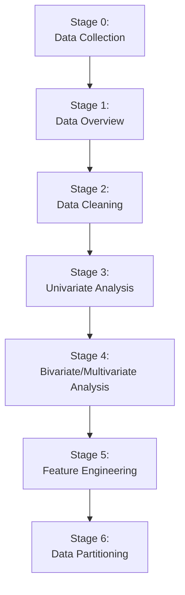

# **Exploratory Data Analysis (EDA) - Complete Guide**

## **1. What is EDA?**
Exploratory Data Analysis (EDA) is the process of using summary statistics and visualizations to understand, summarize, and investigate a dataset **before building a model**. Its goal is to uncover underlying patterns, spot anomalies, test hypotheses, and check assumptions.

### **Core Goals of EDA**
- **Understand** the data's structure, variables, and distributions.
- **Clean** the data by handling missing values, duplicates, and outliers.
- **Discover** relationships, patterns, and trends between variables.
- **Prepare** the data for machine learning with feature engineering and transformation.

---

## **2. The EDA Workflow: A Step-by-Step Guide**

The following flowchart outlines a logical progression for your EDA process. You can use this as a checklist:


### **🛠️ Stage 0: Setup & Data Collection**

```python
# Import core libraries
import pandas as pd
import numpy as np
import matplotlib.pyplot as plt
import seaborn as sns

# Load your dataset
from sklearn.datasets import load_iris
iris = load_iris()
df = pd.DataFrame(data=iris.data, columns=iris.feature_names)
df["target"] = iris.target
```

### **🔍 Stage 1: Data Overview & Inspection**

**Goal:** Get a high-level understanding of the dataset's structure and quality.

**Actions:**
1.  **Dimensions:** `df.shape`
2.  **Sample Data:** `df.head()`, `df.tail()`, `df.sample(5)`
3.  **Data Types:** `df.info()`
4.  **Basic Statistics:** `df.describe()`
5.  **Check for Duplicates:** `df.duplicated().sum()`

```python
print("Dataset Shape:", df.shape)
print("\nData Types:\n", df.dtypes)
print("\nSummary Statistics:\n", df.describe())
print("\nMissing Values:\n", df.isnull().sum())
print("\nDuplicate Rows:", df.duplicated().sum())
```

### **🧹 Stage 2: Data Cleaning**

**Goal:** Handle data quality issues to ensure robust analysis and modeling.

| Issue | How to Detect | Common Solutions |
| :--- | :--- | :--- |
| **Missing Values** | `df.isnull().sum()` | 1. **Drop:** `df.dropna()`<br>2. **Fill:** `df.fillna()`, `df['col'].fillna(df['col'].mean())` |
| **Duplicates** | `df.duplicated().sum()` | **Drop:** `df.drop_duplicates()` |
| **Outliers** | Boxplots, IQR Method, Z-score | 1. **Cap:** `df['col'].clip(lower, upper)`<br>2. **Remove** or **Transform** |

**Handling Outliers (IQR Method):**
```python
Q1 = df['sepal length (cm)'].quantile(0.25)
Q3 = df['sepal length (cm)'].quantile(0.75)
IQR = Q3 - Q1
lower_bound = Q1 - 1.5 * IQR
upper_bound = Q3 + 1.5 * IQR
df['sepal length (cm)'] = df['sepal length (cm)'].clip(lower_bound, upper_bound)
```

### **📊 Stage 3: Univariate Analysis**

**Goal:** Understand the distribution and properties of each variable individually.

| Variable Type | Analysis Methods |
| :--- | :--- |
| **Numerical** | - **Histogram with KDE:** `sns.histplot(data=df, x='col', kde=True)`<br>- **Boxplot:** `sns.boxplot(data=df, x='col')`<br>- **Statistics:** `df['col'].describe()`, `skewness` |
| **Categorical** | - **Frequency Table:** `df['col'].value_counts()`<br>- **Bar Plot:** `sns.countplot(data=df, x='col')` |

**Why it's important for ML:**
- **Skewed Distributions:** Can violate assumptions of models like Linear Regression. May require log/box-cox transformation.
- **Class Imbalance:** In classification, a dominant class can lead to a biased model.

### **🔗 Stage 4: Bivariate & Multivariate Analysis**

**Goal:** Explore relationships and interactions between two or more variables.

| Analysis Type | Visualization | Purpose |
| :--- | :--- | :--- |
| **Num vs. Num** | Scatter Plot (`sns.scatterplot`), Correlation Heatmap (`sns.heatmap`) | Find linear/non-linear relationships. |
| **Cat vs. Num** | Box Plot (`sns.boxplot`), Violin Plot (`sns.violinplot`) | Compare distributions across categories. |
| **Cat vs. Cat** | Stacked Bar Chart, Heatmap of Crosstab | Check for associations between categories. |
| **Multivariate** | Pair Plot (`sns.pairplot`), Scatter Plot with Hue | Understand interactions of 3+ variables. |

```python
# Correlation Heatmap
plt.figure(figsize=(10, 8))
sns.heatmap(df.corr(), annot=True, cmap='coolwarm', fmt='.2f')
plt.title('Correlation Matrix')
plt.show()

# Pair Plot
sns.pairplot(df, hue='target') # 'hue' adds color for a categorical variable
plt.show()
```

### **⚙️ Stage 5: Feature Engineering**

**Goal:** Create new features or transform existing ones to improve model performance.

| Technique | Description | Python Example |
| :--- | :--- | :--- |
| **Handling Categorical** | Convert text to numbers. | `pd.get_dummies(df)` (One-Hot)<br>`LabelEncoder().fit_transform()` (Label) |
| **Binning** | Convert numeric to categorical. | `pd.cut(df['age'], bins=3, labels=['Young', 'Adult', 'Senior'])` |
| **Scaling** | Normalize/standardize features. | `StandardScaler().fit_transform(df[['col']])`<br>`MinMaxScaler().fit_transform(df[['col']])` |
| **Creating New Features** | Derive new insights. | `df['total_volume'] = df['length'] * df['width'] * df['height']` |
| **Date/Time Features** | Extract time components. | `df['year'] = pd.to_datetime(df['date']).dt.year` |

### **📦 Stage 6: Data Partitioning**

**Goal:** Split the cleaned and engineered data into training and testing sets to evaluate model performance fairly.

```python
from sklearn.model_selection import train_test_split

# Define Features (X) and Target (y)
X = df.drop('target', axis=1)
y = df['target']

# Perform the split (e.g., 80% train, 20% test)
X_train, X_test, y_train, y_test = train_test_split(X, y, test_size=0.2, random_state=42)
print(f"Training set: {X_train.shape}, Testing set: {X_test.shape}")
```

**For Imbalanced Datasets:** Use `StratifiedShuffleSplit` or oversampling techniques like **SMOTE** to maintain the class distribution in the splits.

---

## **3. Specialized EDA Topics**

### **Time-Series EDA**
When your data has a time component (e.g., daily sales):
- **Decomposition:** Split into Trend, Seasonality, and Residuals (`seasonal_decompose`).
- **Stationarity Check:** Use the Augmented Dickey-Fuller test (`adfuller`).
- **Autocorrelation:** Plot ACF and PACF to see how past values influence future ones.

### **Key Takeaways & Best Practices**
- **Start Simple:** Always begin with `df.info()` and `df.describe()`.
- **Visualize Everything:** A good plot can reveal what summary statistics cannot.
- **Document Insights:** Keep a log of your findings, hypotheses, and actions taken.
- **Iterate:** EDA is not linear. You may clean data, find new insights, and go back to clean again.
- **Context is King:** Always interpret your findings within the domain/business context. The same correlation might be meaningful in one context and spurious in another.

This revised structure should make your notes easier to follow and implement. Great work on compiling such detailed content