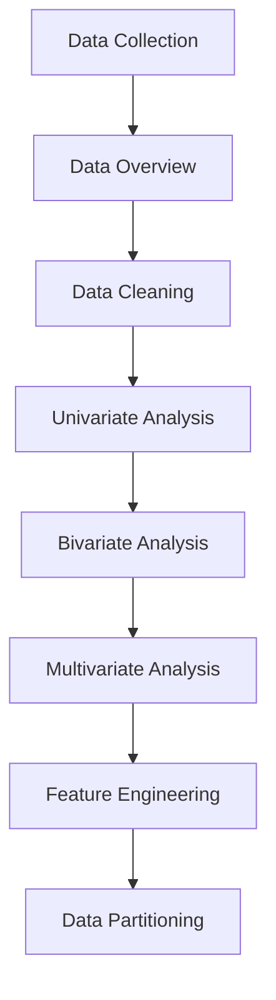

# Exploratory Data Analysis (EDA) - Complete Guide

## 1. Introduction to EDA

### What is Exploratory Data Analysis?
Exploratory Data Analysis (EDA) is the systematic process of examining and understanding datasets through statistical summaries and visualizations. It serves as the foundation for any data science project, helping you uncover underlying patterns, detect anomalies, test hypotheses, and validate assumptions before proceeding to machine learning modeling.

### Core Objectives of EDA
- **Understand Data Structure**: Comprehend the dataset's organization, variable types, and distributions
- **Identify Data Quality Issues**: Detect missing values, outliers, duplicates, and inconsistencies
- **Discover Relationships**: Uncover correlations and patterns between variables
- **Generate Hypotheses**: Formulate insights for further statistical testing and modeling
- **Inform Feature Engineering**: Guide the creation of meaningful features for ML models

### Key Benefits for Machine Learning
- **Improved Model Performance**: Clean, well-understood data leads to better model accuracy
- **Informed Preprocessing**: Strategic decisions about handling missing values and outliers
- **Feature Selection**: Identification of relevant variables for model training
- **Bias Detection**: Early recognition of data imbalances and sampling issues

## 2. The EDA Workflow



### 🛠️ Stage 0: Environment Setup

```python
# Essential imports for EDA
import pandas as pd
import numpy as np
import matplotlib.pyplot as plt
import seaborn as sns
from scipy import stats

# Load sample dataset
from sklearn.datasets import load_iris
iris = load_iris()
df = pd.DataFrame(data=iris.data, columns=iris.feature_names)
df["target"] = iris.target
df["species"] = df["target"].map({0: "setosa", 1: "versicolor", 2: "virginica"})
```

## 3. Comprehensive Data Assessment

### 🔍 Stage 1: Data Overview & Structure Analysis

**Purpose**: Gain initial understanding of dataset scale, structure, and basic characteristics.

```python
def comprehensive_overview(df):
    """Generate complete dataset overview"""
    
    print("=== DATASET OVERVIEW ===")
    print(f"Dataset Shape: {df.shape[0]} rows, {df.shape[1]} columns")
    
    print("\n=== DATA TYPES ===")
    print(df.dtypes)
    
    print("\n=== COLUMN INFORMATION ===")
    print("Columns:", df.columns.tolist())
    
    print("\n=== BASIC STATISTICS ===")
    print(df.describe())
    
    print("\n=== MISSING VALUES ===")
    missing_info = pd.DataFrame({
        'Missing_Count': df.isnull().sum(),
        'Missing_Percentage': (df.isnull().sum() / len(df)) * 100
    })
    print(missing_info)
    
    print("\n=== MEMORY USAGE ===")
    print(f"Total memory: {df.memory_usage(deep=True).sum() / 1024**2:.2f} MB")

# Execute overview
comprehensive_overview(df)
```

### 📊 Stage 2: Data Quality Assessment

**Key Quality Checks**:

| Check Type | Method | Purpose |
|------------|--------|---------|
| **Duplicates** | `df.duplicated().sum()` | Identify repeated records |
| **Constant Columns** | `df.nunique() == 1` | Find non-informative features |
| **High Cardinality** | `df.nunique() > threshold` | Detect potential identifier columns |
| **Data Type Validation** | `df.dtypes` | Verify correct type assignments |

```python
def data_quality_report(df):
    """Generate comprehensive data quality report"""
    
    quality_metrics = {}
    
    # Duplicate analysis
    duplicate_count = df.duplicated().sum()
    quality_metrics['duplicate_percentage'] = (duplicate_count / len(df)) * 100
    
    # Unique value analysis
    unique_counts = df.nunique()
    constant_columns = unique_counts[unique_counts == 1].index.tolist()
    high_cardinality = unique_counts[unique_counts > len(df) * 0.5].index.tolist()
    
    print("=== DATA QUALITY REPORT ===")
    print(f"Duplicate rows: {duplicate_count} ({quality_metrics['duplicate_percentage']:.2f}%)")
    print(f"Constant columns: {constant_columns}")
    print(f"High cardinality columns: {high_cardinality}")
    
    return quality_metrics

quality_report = data_quality_report(df)
```

## 4. Deep Dive: Variable Analysis

### 📈 Stage 3: Univariate Analysis

**Purpose**: Understand individual variable distributions and characteristics.

#### Numerical Variables Analysis

```python
def analyze_numerical_variables(df, numerical_columns):
    """Comprehensive analysis of numerical features"""
    
    print("=== NUMERICAL VARIABLES ANALYSIS ===")
    
    for col in numerical_columns:
        print(f"\n--- {col} ---")
        
        # Basic statistics
        stats = df[col].describe()
        skewness = df[col].skew()
        kurtosis = df[col].kurtosis()
        
        print(f"Skewness: {skewness:.3f} | Kurtosis: {kurtosis:.3f}")
        print(f"Range: {stats['min']:.3f} to {stats['max']:.3f}")
        print(f"IQR: {stats['75%'] - stats['25%']:.3f}")
        
        # Visualization
        fig, axes = plt.subplots(1, 2, figsize=(12, 4))
        
        # Histogram with KDE
        sns.histplot(data=df, x=col, kde=True, ax=axes[0])
        axes[0].set_title(f'Distribution of {col}')
        
        # Box plot
        sns.boxplot(data=df, x=col, ax=axes[1])
        axes[1].set_title(f'Box Plot of {col}')
        
        plt.tight_layout()
        plt.show()

# Identify numerical columns
numerical_cols = df.select_dtypes(include=[np.number]).columns.tolist()
analyze_numerical_variables(df, numerical_cols)
```

#### Categorical Variables Analysis

```python
def analyze_categorical_variables(df, categorical_columns):
    """Comprehensive analysis of categorical features"""
    
    print("=== CATEGORICAL VARIABLES ANALYSIS ===")
    
    for col in categorical_columns:
        print(f"\n--- {col} ---")
        
        # Frequency analysis
        value_counts = df[col].value_counts()
        percentages = df[col].value_counts(normalize=True) * 100
        
        freq_table = pd.DataFrame({
            'Count': value_counts,
            'Percentage': percentages
        })
        print(freq_table)
        
        # Visualization
        plt.figure(figsize=(10, 5))
        
        # Bar plot
        sns.countplot(data=df, x=col, order=value_counts.index)
        plt.title(f'Distribution of {col}')
        plt.xticks(rotation=45)
        plt.tight_layout()
        plt.show()

# Identify categorical columns
categorical_cols = df.select_dtypes(include=['object']).columns.tolist()
analyze_categorical_variables(df, categorical_cols)
```

### 🔗 Stage 4: Bivariate Analysis

**Purpose**: Explore relationships between pairs of variables.

#### Numerical vs Numerical Analysis

```python
def numerical_bivariate_analysis(df, numerical_cols, target=None):
    """Analyze relationships between numerical variables"""
    
    # Correlation analysis
    correlation_matrix = df[numerical_cols].corr()
    
    plt.figure(figsize=(10, 8))
    sns.heatmap(correlation_matrix, annot=True, cmap='coolwarm', 
                center=0, fmt='.2f', square=True)
    plt.title('Correlation Heatmap')
    plt.tight_layout()
    plt.show()
    
    # Scatter plot matrix
    if len(numerical_cols) <= 6:  # Avoid overcrowding
        sns.pairplot(df[numerical_cols], diag_kind='kde')
        plt.suptitle('Pairwise Relationships', y=1.02)
        plt.show()
    
    return correlation_matrix

corr_matrix = numerical_bivariate_analysis(df, numerical_cols)
```

#### Numerical vs Categorical Analysis

```python
def numerical_categorical_analysis(df, numerical_col, categorical_col):
    """Compare numerical distributions across categories"""
    
    fig, axes = plt.subplots(1, 2, figsize=(15, 5))
    
    # Box plot
    sns.boxplot(data=df, x=categorical_col, y=numerical_col, ax=axes[0])
    axes[0].set_title(f'{numerical_col} by {categorical_col}')
    axes[0].tick_params(axis='x', rotation=45)
    
    # Violin plot
    sns.violinplot(data=df, x=categorical_col, y=numerical_col, ax=axes[1])
    axes[1].set_title(f'Distribution of {numerical_col} by {categorical_col}')
    axes[1].tick_params(axis='x', rotation=45)
    
    plt.tight_layout()
    plt.show()
    
    # Statistical summary by category
    print(f"\nStatistical Summary of {numerical_col} by {categorical_col}:")
    summary = df.groupby(categorical_col)[numerical_col].describe()
    print(summary)

# Example usage
numerical_categorical_analysis(df, 'sepal length (cm)', 'species')
```

### 🌐 Stage 5: Multivariate Analysis

**Purpose**: Understand complex interactions between multiple variables.

```python
def multivariate_analysis(df, numerical_cols, categorical_col=None):
    """Comprehensive multivariate analysis"""
    
    if categorical_col:
        # Pairplot with hue
        sns.pairplot(df, vars=numerical_cols, hue=categorical_col, 
                    diag_kind='kde', palette='viridis')
        plt.suptitle(f'Multivariate Analysis by {categorical_col}', y=1.02)
        plt.show()
    
    # Parallel coordinates plot for numerical data
    if len(numerical_cols) > 2:
        from pandas.plotting import parallel_coordinates
        plt.figure(figsize=(12, 6))
        parallel_coordinates(df, class_column=categorical_col if categorical_col else None, 
                           cols=numerical_cols)
        plt.title('Parallel Coordinates Plot')
        plt.xticks(rotation=45)
        plt.tight_layout()
        plt.show()

multivariate_analysis(df, numerical_cols, 'species')
```

## 5. Advanced Data Quality Management

### 🧹 Stage 6: Comprehensive Data Cleaning

#### Missing Value Treatment Strategies

| Strategy | Use Case | Implementation |
|----------|----------|----------------|
| **Deletion** | Missing < 5% of data, completely random | `df.dropna()` |
| **Mean/Median Imputation** | Numerical data, normal distribution | `df.fillna(df.mean())` |
| **Mode Imputation** | Categorical data | `df.fillna(df.mode().iloc[0])` |
| **Forward/Backward Fill** | Time series data | `df.fillna(method='ffill')` |
| **Predictive Imputation** | Complex patterns, significant missingness | `KNNImputer`, `IterativeImputer` |

```python
def handle_missing_values(df, strategy='auto'):
    """Intelligent missing value handling"""
    
    missing_summary = df.isnull().sum()
    missing_columns = missing_summary[missing_summary > 0].index.tolist()
    
    if not missing_columns:
        print("No missing values detected!")
        return df
    
    df_clean = df.copy()
    
    for col in missing_columns:
        missing_percentage = (df[col].isnull().sum() / len(df)) * 100
        
        if missing_percentage > 30:
            # Consider dropping column if too many missing values
            print(f"Dropping column {col} ({missing_percentage:.1f}% missing)")
            df_clean.drop(col, axis=1, inplace=True)
            
        elif df[col].dtype in ['float64', 'int64']:
            # Numerical imputation
            if abs(df[col].skew()) < 1:
                df_clean[col].fillna(df[col].median(), inplace=True)
                print(f"Filled numerical {col} with median")
            else:
                df_clean[col].fillna(df[col].median(), inplace=True)
                print(f"Filled numerical {col} with median (skewed distribution)")
                
        else:
            # Categorical imputation
            df_clean[col].fillna(df[col].mode()[0], inplace=True)
            print(f"Filled categorical {col} with mode")
    
    return df_clean

# Apply missing value treatment
df_clean = handle_missing_values(df)
```

#### Outlier Detection and Treatment

```python
def detect_and_treat_outliers(df, numerical_cols, method='IQR'):
    """Comprehensive outlier management"""
    
    outlier_report = {}
    df_treated = df.copy()
    
    for col in numerical_cols:
        if method == 'IQR':
            Q1 = df[col].quantile(0.25)
            Q3 = df[col].quantile(0.75)
            IQR = Q3 - Q1
            lower_bound = Q1 - 1.5 * IQR
            upper_bound = Q3 + 1.5 * IQR
            
            outliers = df[(df[col] < lower_bound) | (df[col] > upper_bound)]
            outlier_count = len(outliers)
            
        elif method == 'Z-score':
            z_scores = np.abs(stats.zscore(df[col].dropna()))
            outlier_count = np.sum(z_scores > 3)
            lower_bound = df[col].mean() - 3 * df[col].std()
            upper_bound = df[col].mean() + 3 * df[col].std()
        
        outlier_percentage = (outlier_count / len(df)) * 100
        outlier_report[col] = {
            'outlier_count': outlier_count,
            'outlier_percentage': outlier_percentage,
            'bounds': (lower_bound, upper_bound)
        }
        
        # Cap outliers
        if outlier_percentage < 5:  # Only cap if outliers are rare
            df_treated[col] = df_treated[col].clip(lower_bound, upper_bound)
            print(f"Capped outliers in {col}: {outlier_count} instances ({outlier_percentage:.1f}%)")
    
    return df_treated, outlier_report

# Detect and treat outliers
df_clean, outlier_info = detect_and_treat_outliers(df_clean, numerical_cols)
```

## 6. Feature Engineering for Machine Learning

### ⚙️ Stage 7: Advanced Feature Engineering

#### Feature Transformation

```python
def feature_transformation(df, numerical_cols):
    """Apply transformations to improve feature quality"""
    
    df_transformed = df.copy()
    
    for col in numerical_cols:
        # Handle skewness
        skewness = df[col].skew()
        
        if abs(skewness) > 1:
            # Highly skewed - use log transform
            if df[col].min() > 0:  # Log requires positive values
                df_transformed[f'{col}_log'] = np.log1p(df[col])
                print(f"Applied log transform to {col} (skewness: {skewness:.3f})")
            else:
                # Use box-cox for negative values
                df_transformed[f'{col}_boxcox'], _ = stats.boxcox(df[col] - df[col].min() + 1)
                print(f"Applied box-cox transform to {col} (skewness: {skewness:.3f})")
        
        # Create interaction features
        for other_col in numerical_cols:
            if col != other_col and numerical_cols.index(col) < numerical_cols.index(other_col):
                df_transformed[f'{col}_x_{other_col}'] = df[col] * df[other_col]
    
    return df_transformed

df_engineered = feature_transformation(df_clean, numerical_cols)
```

#### Categorical Encoding

```python
def smart_categorical_encoding(df, categorical_cols, target=None):
    """Intelligent encoding of categorical variables"""
    
    df_encoded = df.copy()
    
    for col in categorical_cols:
        unique_count = df[col].nunique()
        
        if unique_count == 2:
            # Binary encoding
            df_encoded[col] = df_encoded[col].astype('category').cat.codes
            print(f"Label encoded binary variable: {col}")
            
        elif unique_count <= 10:
            # One-hot encoding for low cardinality
            dummies = pd.get_dummies(df[col], prefix=col)
            df_encoded = pd.concat([df_encoded, dummies], axis=1)
            df_encoded.drop(col, axis=1, inplace=True)
            print(f"One-hot encoded: {col} ({unique_count} categories)")
            
        else:
            # High cardinality - use target encoding or frequency encoding
            if target and target in df.columns:
                # Target encoding
                target_mean = df.groupby(col)[target].mean()
                df_encoded[f'{col}_target_encoded'] = df[col].map(target_mean)
                print(f"Target encoded: {col}")
            else:
                # Frequency encoding
                freq_encoding = df[col].value_counts() / len(df)
                df_encoded[f'{col}_freq_encoded'] = df[col].map(freq_encoding)
                df_encoded.drop(col, axis=1, inplace=True)
                print(f"Frequency encoded: {col}")
    
    return df_encoded

# Apply encoding
categorical_columns = df_engineered.select_dtypes(include=['object']).columns.tolist()
if categorical_columns:
    df_encoded = smart_categorical_encoding(df_engineered, categorical_columns, 'target')
else:
    df_encoded = df_engineered
```

## 7. Data Partitioning Strategies

### 📊 Stage 8: Model Preparation

```python
from sklearn.model_selection import train_test_split, StratifiedKFold
from sklearn.preprocessing import StandardScaler, MinMaxScaler

def prepare_ml_data(df, target_column, test_size=0.2, scaling_method='standard'):
    """Prepare data for machine learning modeling"""
    
    # Separate features and target
    X = df.drop(columns=[target_column])
    y = df[target_column]
    
    # Handle categorical target for classification
    if y.dtype == 'object':
        from sklearn.preprocessing import LabelEncoder
        le = LabelEncoder()
        y = le.fit_transform(y)
        print("Encoded target variable for classification")
    
    # Train-test split with stratification for classification
    if len(np.unique(y)) < 20:  # Classification problem
        X_train, X_test, y_train, y_test = train_test_split(
            X, y, test_size=test_size, stratify=y, random_state=42
        )
        print("Applied stratified train-test split")
    else:  # Regression problem
        X_train, X_test, y_train, y_test = train_test_split(
            X, y, test_size=test_size, random_state=42
        )
        print("Applied random train-test split")
    
    # Feature scaling
    numerical_features = X.select_dtypes(include=[np.number]).columns
    
    if scaling_method == 'standard':
        scaler = StandardScaler()
    elif scaling_method == 'minmax':
        scaler = MinMaxScaler()
    else:
        scaler = None
    
    if scaler:
        X_train[numerical_features] = scaler.fit_transform(X_train[numerical_features])
        X_test[numerical_features] = scaler.transform(X_test[numerical_features])
        print(f"Applied {scaling_method} scaling to numerical features")
    
    print(f"\nFinal Dataset Shapes:")
    print(f"X_train: {X_train.shape}, X_test: {X_test.shape}")
    print(f"y_train: {y_train.shape}, y_test: {y_test.shape}")
    
    return X_train, X_test, y_train, y_test, scaler

# Prepare data for ML
X_train, X_test, y_train, y_test, feature_scaler = prepare_ml_data(
    df_encoded, 'target', test_size=0.2, scaling_method='standard'
)
```

## 8. Advanced EDA Techniques

### 📈 Time Series Analysis

```python
def time_series_analysis(df, date_column, value_column):
    """Comprehensive time series EDA"""
    
    # Ensure datetime format
    df[date_column] = pd.to_datetime(df[date_column])
    df = df.set_index(date_column).sort_index()
    
    # Decomposition
    from statsmodels.tsa.seasonal import seasonal_decompose
    
    decomposition = seasonal_decompose(df[value_column], model='additive', period=12)
    
    fig, axes = plt.subplots(4, 1, figsize=(12, 10))
    decomposition.observed.plot(ax=axes[0], title='Original')
    decomposition.trend.plot(ax=axes[1], title='Trend')
    decomposition.seasonal.plot(ax=axes[2], title='Seasonality')
    decomposition.resid.plot(ax=axes[3], title='Residuals')
    plt.tight_layout()
    plt.show()
    
    # Stationarity test
    from statsmodels.tsa.stattools import adfuller
    
    adf_result = adfuller(df[value_column].dropna())
    print(f"ADF Statistic: {adf_result[0]:.3f}")
    print(f"p-value: {adf_result[1]:.3f}")
    print("Stationary" if adf_result[1] < 0.05 else "Non-stationary")
    
    # Autocorrelation
    from statsmodels.graphics.tsaplots import plot_acf, plot_pacf
    
    fig, axes = plt.subplots(2, 1, figsize=(12, 8))
    plot_acf(df[value_column], ax=axes[0], lags=40)
    plot_pacf(df[value_column], ax=axes[1], lags=40)
    plt.tight_layout()
    plt.show()
```

### 🎯 Target Variable Analysis

```python
def comprehensive_target_analysis(df, target_column):
    """Deep dive into target variable characteristics"""
    
    print("=== TARGET VARIABLE ANALYSIS ===")
    
    target = df[target_column]
    
    # Determine problem type
    unique_values = target.nunique()
    if unique_values < 10 or target.dtype == 'object':
        problem_type = 'Classification'
        print(f"Problem Type: {problem_type}")
        print(f"Number of classes: {unique_values}")
        
        # Class distribution
        class_dist = target.value_counts()
        print("\nClass Distribution:")
        for class_name, count in class_dist.items():
            percentage = (count / len(target)) * 100
            print(f"  {class_name}: {count} ({percentage:.1f}%)")
        
        # Visualize distribution
        plt.figure(figsize=(10, 5))
        sns.countplot(data=df, x=target_column)
        plt.title('Target Variable Distribution')
        plt.xticks(rotation=45)
        plt.tight_layout()
        plt.show()
        
    else:
        problem_type = 'Regression'
        print(f"Problem Type: {problem_type}")
        
        # Distribution analysis
        print(f"\nTarget Statistics:")
        print(target.describe())
        
        # Visualize distribution
        fig, axes = plt.subplots(1, 2, figsize=(12, 4))
        sns.histplot(target, kde=True, ax=axes[0])
        axes[0].set_title('Target Distribution')
        sns.boxplot(y=target, ax=axes[1])
        axes[1].set_title('Target Boxplot')
        plt.tight_layout()
        plt.show()
    
    return problem_type

# Analyze target variable
problem_type = comprehensive_target_analysis(df, 'species')
```

## 9. EDA Summary and Reporting

### 📋 Comprehensive EDA Report

```python
def generate_eda_report(df, target_column=None):
    """Generate comprehensive EDA report"""
    
    report = {
        'dataset_info': {
            'shape': df.shape,
            'memory_usage': df.memory_usage(deep=True).sum() / 1024**2,
            'data_types': dict(df.dtypes.value_counts())
        },
        'quality_metrics': {
            'missing_values': dict(df.isnull().sum()),
            'duplicates': df.duplicated().sum(),
            'constant_columns': [col for col in df.columns if df[col].nunique() == 1]
        },
        'variable_summary': {}
    }
    
    # Numerical variables summary
    numerical_cols = df.select_dtypes(include=[np.number]).columns
    if len(numerical_cols) > 0:
        report['variable_summary']['numerical'] = {
            'count': len(numerical_cols),
            'summary_stats': df[numerical_cols].describe().to_dict(),
            'correlations': df[numerical_cols].corr().to_dict() if len(numerical_cols) > 1 else {}
        }
    
    # Categorical variables summary
    categorical_cols = df.select_dtypes(include=['object']).columns
    if len(categorical_cols) > 0:
        cat_summary = {}
        for col in categorical_cols:
            cat_summary[col] = {
                'unique_count': df[col].nunique(),
                'top_categories': dict(df[col].value_counts().head(5))
            }
        report['variable_summary']['categorical'] = cat_summary
    
    # Target analysis if provided
    if target_column and target_column in df.columns:
        target_analysis = {
            'type': 'categorical' if df[target_column].dtype == 'object' or df[target_column].nunique() < 10 else 'numerical',
            'unique_values': df[target_column].nunique(),
            'missing_values': df[target_column].isnull().sum()
        }
        report['target_analysis'] = target_analysis
    
    return report

# Generate final report
final_report = generate_eda_report(df, 'species')
print("=== EDA COMPLETE ===")
print(f"Dataset processed: {final_report['dataset_info']['shape']}")
print(f"Memory usage: {final_report['dataset_info']['memory_usage']:.2f} MB")
```

## 10. Key Insights and Next Steps

### 🎯 Actionable Insights from EDA

1. **Data Quality Actions**:
   - Address missing values based on percentage and pattern
   - Treat outliers using appropriate methods
   - Remove or transform highly correlated features

2. **Feature Engineering Opportunities**:
   - Create interaction terms for highly correlated variables
   - Apply transformations to handle skewness
   - Encode categorical variables based on cardinality

3. **Modeling Considerations**:
   - Choose appropriate algorithms based on problem type
   - Implement cross-validation strategy
   - Address class imbalance if present

4. **Business Implications**:
   - Validate findings with domain experts
   - Prioritize features with strong predictive power
   - Document assumptions and limitations

